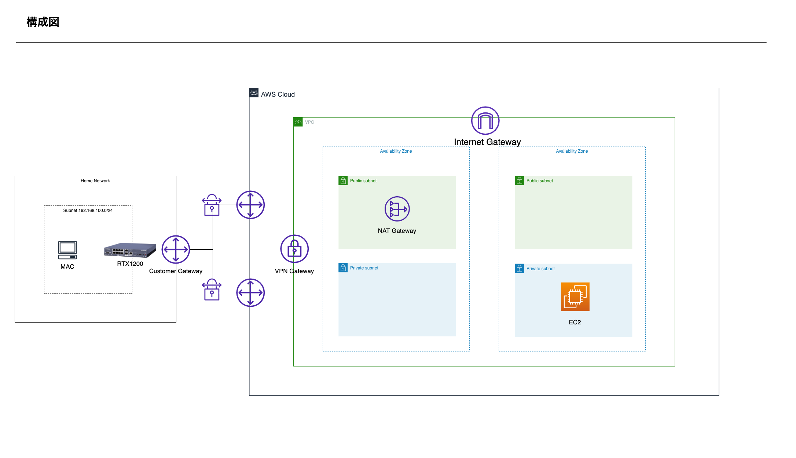

# aws-site-to-site-vpn

## 概要

AWS Site to Site VPN(YAMAHA)環境構築

## 構成図

## 参考

- [自宅とAWSをVPN接続してみた (Ciscoルータ編)](https://dev.classmethod.jp/articles/aws-cisco-site-to-site-vpn/)
- [YAMAHA RTX1200 でAWS サイト間VPN接続の構築](https://qiita.com/u-bayashi/items/b9fb32ab1c3bc8210ef0)
- [Amazon VPCとVPN(IPsec)接続するルーターの設定 : コマンド設定](https://network.yamaha.com/setting/router_firewall/cloud/amazon_vpc/setup_rt)